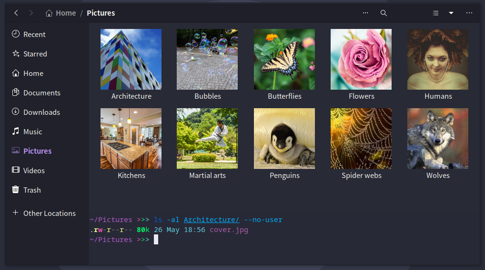

# go-thumbnailer

A cover thumbnailer written in Go for performance and reliability.



Tested and works in: [Caja](https://github.com/mate-desktop/caja), [Nemo](https://github.com/linuxmint/nemo), [Thunar](https://github.com/xfce-mirror/thunar), [Nautilus](https://github.com/GNOME/nautilus).

## Usage (NixOS)

Step 1. Add my personal nixpkgs branch to your flake inputs.

```nix
{
  inputs = {
    nixpkgs.url = "github:donovanglover/nixpkgs/personal-unstable";
  }
}
```

Step 2. Add `go-thumbnailer` to your `systemPackages`.

```nix
{ pkgs, ... }:

{
  environment.systemPackages = with pkgs; [
    go-thumbnailer
  ];
}
```

Step 3. Rebuild your system (usually with `nixos-rebuild switch --flake .`).

## Other distributions

First install the dependency [libvips](https://github.com/libvips/libvips) and build the binary with `go build`. Then, copy the executable and thumbnailer to your /usr directory, like so:

```fish
git clone https://github.com/donovanglover/go-thumbnailer
cd go-thumbnailer && go build -o go-thumbnailer

sudo install -Dm755 go-thumbnailer /usr/bin/go-thumbnailer
sudo install -Dm644 go.thumbnailer /usr/share/thumbnailers/go.thumbnailer
```

## Purpose

Images are a great way to make browsing through directories easier, especially when each directory holds specific content, such as a certain music album, video series, or other media.

With go-thumbnailer, any `cover.jpg` or `cover.png` you place in a directory will replace the default folder icon in nautilus with a thumbnail of that image.

This means that you can use high quality cover images, and go-thumbnailer will automatically generate proper thumbnails for them.

## Why go-thumbnailer?

- Portability. Your folder icons are now part of the folders themselves, instead of [hidden](https://askubuntu.com/questions/153575/where-does-gnome-nautilus-store-directory-icons) inside of GNOME's virtual file system. No effort from you is required to keep your folder icons.
- Simplicity. Using a cover image is as simple as making sure that the directory has a `cover.jpg` or `cover.png`. No need to click through GUIs or deal with a database.
- Ease of sharing. You can share folders without worrying about useless metadata files like desktop.ini. Any other user that uses go-thumbnailer will automatically see your cover images.
- Progressive enhancement. You can use go-thumbnailer at your own pace, gradually adding cover images as you see fit.
- Graceful degradation. Your files are exactly the same as they were with or without go-thumbnailer.
- Multiuse. The same cover images can be used with other applications such as [mpv](https://github.com/mpv-player/mpv) (enabled by default) and media servers like [Navidrome](https://github.com/navidrome/navidrome).

## Comparison to cover-thumbnailer

[cover-thumbnailer](https://github.com/flozz/cover-thumbnailer) is a similar project written in Python. Unlike cover-thumbnailer, go-thumbnailer includes neither a GUI nor settings for the user.

go-thumbnailer is faster and focuses on providing a universal experience for cover images, following an "it just works" philosophy with no manual configuration necessary.

## Known issues

Most file browsers update thumbnails when the modified date changes, as per the [Thumbnail Managing Standard](https://specifications.freedesktop.org/thumbnail-spec/thumbnail-spec-latest.html#MODIFICATIONS). This is good when thumbnailing individual files, but becomes a problem when thumbnailing directories since their modification date [changes](https://stackoverflow.com/questions/3620684/directory-last-modified-date/3620704#3620704) when the file structure inside them changes, such as when you rename one of the files.

What this means is that it's up to the file browser to gracefully handle this unusual behavior of the modified date being updated but the thumbnail being the same.

### Thunar

- Very fast, although work is being done to [make it faster](https://gitlab.xfce.org/xfce/tumbler/-/issues/1).
- Loads large directories well.
- Uses the default icon when loading thumbnails, so directories will use the folder icon while they load.
- No infinite loading bug, and no visual indicator that the thumbnail is being regenerated, possibly because it uses the existing folder icon instead of `image-loading.svg`.

Cons of using thunar:

- Thumbnails aren't generated until you scroll to them, which means that you can't open a large directory and have all thumbnails be automatically generated.
- Thumbnail sizes for non-directories may be less polished than Nautilus.

When using thunar, make sure you have the [tumbler](https://gitlab.xfce.org/xfce/tumbler) package installed. [Source](https://superuser.com/questions/258633/why-is-thunar-not-creating-and-showing-thumbnails-of-images/259471#259471).

### Caja

- Fast.
- Has a cascading effect on first load, followed by loading everything at once when revisiting that directory.
- Uses `image-loading.svg` while directory thumbnail loads.
- Visual indicator that the thumbnail is being regenerated, but no infinite loading bug.

### Nautilus

- Fast, but thumbnail generation was intentionally slowed down based on the source code. See [lines 82-84](https://gitlab.gnome.org/GNOME/nautilus/-/blob/794931998cb27b7ca94651c72300a5ed167a8951/src/nautilus-thumbnails.c#L82-84) and [147-171](https://gitlab.gnome.org/GNOME/nautilus/-/blob/794931998cb27b7ca94651c72300a5ed167a8951/src/nautilus-thumbnails.c#L147-171) of `nautilus-thumbnails.c`. The issue [has been discussed](https://gitlab.gnome.org/GNOME/nautilus/-/issues/856) and [several](https://gitlab.gnome.org/GNOME/nautilus/-/merge_requests/660) [solutions](https://gitlab.gnome.org/GNOME/nautilus/-/merge_requests/700) have been proposed.
- Has a cascading effect when loading large directories. See: [Gnome Files is unusable with big folders](https://gitlab.gnome.org/GNOME/nautilus/-/issues/1967) and [Folder contents scroll down as thumbnails are generated in icon view](https://gitlab.gnome.org/GNOME/nautilus/-/issues/1720).
- Uses `image-loading.svg` while directory thumbnail loads.
- Has infinite loading bug after changing the file structure of the current directory and moving up one directory. A [known issue](https://gitlab.gnome.org/GNOME/nautilus/-/issues/1887) since June 2021.

### Nemo

- Slow to generate thumbnails.
- Has a cascading effect when loading large directories.
- Uses `image-loading.svg` while directory thumbnail loads.
- Has infinite loading bug after changing the file structure of the current directory and moving up one directory. Similar to [this bug report](https://github.com/linuxmint/nemo/issues/2736), but triggered differently.

### Summary

For ease of access, here's a summary of above.

| File browser | Fast? | No cascade?  | Folder placeholders? | No infinite loading bug? |
| --- | :---: | :---: | :---: | :---: |
| **Thunar** | :white_check_mark: | :white_check_mark: | :white_check_mark: | :white_check_mark: |
| **Caja** | :white_check_mark: | After first load | :x: | :white_check_mark: |
| **Nautilus** | :white_check_mark: | :x: | :x: | :x: |
| **Nemo** | :x: | :x: | :x: | :x: |

Recommendation: Use Nautilus and deal with the infinite loading bug.
